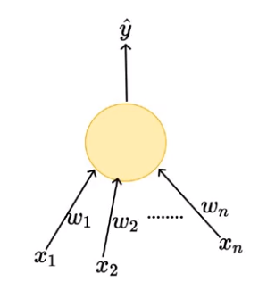

# Perceptron_Model

This repository contains the implementation of perceptron model.

A perceptron is a fundamental unit of the neural network which takes weighted inputs, process it and capable of performing binary classifications. check out my post on medium to understand the working of [perceptron](https://hackernoon.com/perceptron-deep-learning-basics-3a938c5f84b6).

Medium Article: https://hackernoon.com/perceptron-deep-learning-basics-3a938c5f84b6

Medium Handle: https://hackernoon.com/@niranjankumarc

